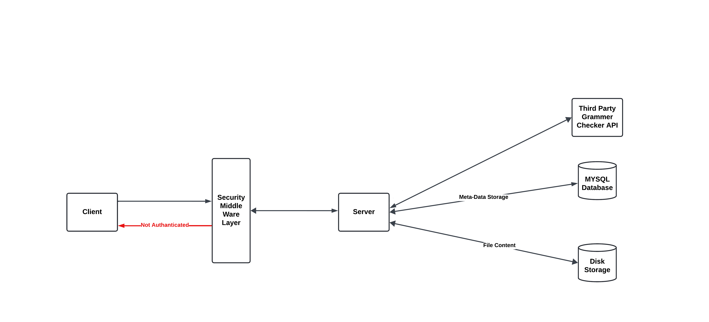

# Markdown Note-taking App 📓

A backend REST API'S to manage note-taking with Markdown text and file attachments. The app allows users to upload notes, check grammar, and retrieve notes as rendered HTML or downloadable files. Built with Java and Spring Boot, this app is designed with scalability and clean architecture in mind.

---

## Table of Contents

1. [Features](#features)
2. [Technologies Used](#technologies-used)
3. [System Design](#system-design)
4. [API Endpoints](#api-endpoints)
5. [Future Enhancements](#future-enhancements)

---

## Features

- **Markdown Note Management**:
  - Add Markdown notes with or without file attachments.
  - Retrieve notes as rendered HTML or raw Markdown.
- **File Upload and Handling**:
  - Securely upload and store files (images, PDFs, etc.).
  - Avoid file name collisions with a unique storage strategy.
- **Grammar Check**:
  - Validate and suggest corrections for notes using a grammar API.
- **RESTful Design**:
  - Follows clean API design principles.
  - Input validation and error handling for a seamless user experience.

---

## Technologies Used

- **Backend**: Java, Spring Boot,Spring Data JPA , Hibernate(ORM)
- **File Storage**: Local File System
- **Database**: Relational Database (MySQL)
- **Markdown Parsing**: Flexmark library
- **Grammar Check API**: LanguageTool API
- **Build Tool**: Maven

---

## System Design

Here’s the system design diagram representing the architecture and data flow for the app:



**Components**:

1. **API Gateway**: Handles all incoming requests.
2. **Controller Layer**: Manages endpoints for notes and file uploads.
3. **Service Layer**: Contains the business logic for processing requests.
4. **Data Layer**: Interacts with the database for CRUD operations.
5. **File Storage**: Manages file uploads and retrieval.
6. **Grammar Checker Service**: Connects to the external LanguageTool API.

## API Endpoints

1. **Create Note**
   `POST /api/notes`

   Accepts Markdown content and optional files as part of the note.

   **Request:**

   ```Json
     {
       "title": "Sample Note",
       "content": "## This is a markdown note",
       "userID": "123"
     }
   ```

   **Response:**

   ```json
   {
     "noteID": "456",
     "message": "Note created successfully"
   }
   ```

2. **Retrieve Note as HTML**

   `GET /api/notes/{noteID}`
   Renders the Markdown note as HTML.

3. **Check Grammar**

   `POST /api/grammar-check`
   Accepts text input and returns grammar suggestions.

   **Request:**

   ```json
   {
     "text": "This is a sampl text with erors."
   }
   ```

   **Response:**

   ```json
   {
     "suggestions": [
       {
         "message": "Possible typo",
         "replacements": ["sample"]
       },
       {
         "message": "Spelling error",
         "replacements": ["errors"]
       }
     ]
   }
   ```

4. **Download Attachments**

   `GET /api/notes/{noteID}/attachments`
   Downloads the files associated with a note.

## Future Enhancements

- Implement support for note versioning.
- Add user authentication and role-based access.
- Extend file storage to support cloud services like AWS S3.
- Introduce filters for searching and categorizing notes.
